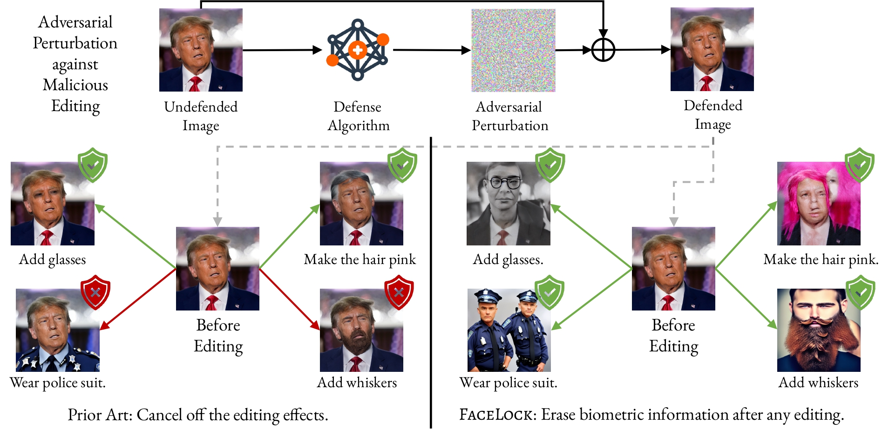

# FaceLock

[](https://arxiv.org/abs/2411.16832) [](https://opensource.org/licenses/MIT)

<table align="center">
  <tr>
    <td align="center"> 
       
      <br>
      <em style="font-size: 18px;">  <strong style="font-size: 18px;">Figure 1:</strong> An illustration of adversarial perturbation generation for safeguarding personal images.</em>
    </td>
  </tr>
</table>

Welcome to the official repository for the paper, [Edit Away and My Face Will not Stay: Personal Biometric Defense against Malicious Generative Editing](https://arxiv.org/abs/2411.16832).


## Abstract

Recent advancements in diffusion models have made generative image editing more accessible than ever. While these developments allow users to generate creative edits with ease, they also raise significant ethical concerns, particularly regarding malicious edits to human portraits that threaten individuals' privacy and identity security. Existing general-purpose image protection methods primarily focus on generating adversarial perturbations to nullify edit effects. However, these approaches often exhibit instability to protect against diverse editing requests. In this work, we introduce a novel perspective to personal human portrait protection against malicious editing. Unlike traditional methods aiming to prevent edits from taking effect, our method, **FaceLock**, optimizes adversarial perturbations to ensure that original biometric information---such as facial features---is either destroyed or substantially altered post-editing, rendering the subject in the edited output biometrically unrecognizable. Our approach innovatively integrates facial recognition and visual perception factors into the perturbation optimization process, ensuring robust protection against a variety of editing attempts. Besides, we shed light on several critical issues with commonly used evaluation metrics in image editing and reveal cheating methods by which they can be easily manipulated, leading to deceptive assessments of protection. Through extensive experiments, we demonstrate that **FaceLock** significantly outperforms all baselines in defense performance against a wide range of malicious edits. Moreover, our method also exhibits strong robustness against purification techniques. Our work not only advances the state-of-the-art in biometric defense but also sets the foundation for more secure and privacy-preserving practices in image editing.

## Environment

We provide a [conda env file](environment.yml) for environment setup.

```bash
conda env create -f environment.yml
conda activate facelock
```

## Single Image Edit and Defend

We begin by presenting the code for image editing and defending applied to a single input image.

```bash
python edit.py --input_path=${input image path} --prompt=${the instruction prompt used to edit the image} [--num_inference_steps=100 --image_guidance_scale=1.5 --guidance_scale=7.5 --help]
```

Arguments explanation:

- `input_path` the path to the image to be edited
- `prompt` the instruction prompt used to edit the image
- `num_inference, image_guidance_scale, guidance_scale` configurations used to guide the image editing process
- `help` to view other arguments for image editing

```bash
python defend.py --input_path=${input image path} --defend_method=${selected defense method} [--attack_budget=0.03 --step_size=0.01 --num_iters=100 --help]
```

Argument explanation:

- `input_path` the path to the image to be protected
- `defend_method` the selected defense method, we provide options among `[encoder/vae/cw/facelock]`
- `attack_budget, step_size, num_iters` hyper-parameters for the defend process
- `help` to view other arguments for defending a single image

## Scaling Up

Next, we extend this to demonstrate the code for handling image editing and defending across multiple images.

```bash
python main_edit.py --src_dir=${input image dir} --edit_dir=${output image dir} [--num_inference_steps=100 --image_guidance_scale=1.5 --guidance_scale=7.5 --help]
```

Arguments explanation:

- `src_dir` the path to the directory of the source images to be edited
- `edit_dir` the path to the directory containing the edited images generated
- other arguments are similar to the single image editing version, use `help` to see more details

```bash
python main_defend.py --image_dir=${input image dir} --output_dir=${output image dir} --defend_method=${selected defense method} [--attack_budget=0.03 --step_size=0.01 --num_iters=100 --help]
```

Arguments explanation:

- `image_dir` the path to the directory of the source images to be protected
- `output_dir` the path to the directory containing the protected images generated
- other arguments are similar to the single image defending version, use `help` to see more details

## Evaluation

We provide the evaluation code for computing the `PSNR, SSIM, LPIPS, CLIP-S, CLIP-I, FR` metrics mentioned in the paper.

```bash
cd evaluation
# PSNR metric
python eval_psnr.py --clean_edit_dir=${path to the clean edits} --defend_edit_dirs ${sequence of path to the protected edits} --seed=${the seed used to edit and evaluate on}
# SSIM metric
python eval_ssim.py --clean_edit_dir=${path to the clean edits} --defend_edit_dirs ${sequence of path to the protected edits} --seed=${the seed used to edit and evaluate on}
# LPIPS metric
python eval_lpips.py --clean_edit_dir=${path to the clean edits} --defend_edit_dirs ${sequence of path to the protected edits} --seed=${the seed used to edit and evaluate on}
# CLIP-S metric
python eval_clip_s.py --src_dir=${path to the source images} --defend_edit_dirs ${sequence of path to the protected edits} --seed=${the seed used to edit and evaluate on} [--clean_edit_dir=${path to the clean edits}]
# CLIP-I metric
python eval_clip_i.py --src_dir=${path to the source images} --defend_edit_dirs ${sequence of path to the protected edits} --seed=${the seed used to edit and evaluate on} [--clean_edit_dir=${path to the clean edits}]
# FR metric
python eval_facial.py --src_dir=${path to the source images} --defend_edit_dirs ${sequence of path to the protected edits} --seed=${the seed used to edit and evaluate on} [--clean_edit_dir=${path to the clean edits}]
```

For `PSNR`, `SSIM`, and `LPIPS`, the computations are performed between the edits on the protected images and the edits on the clean images. Therefore, the inputs `defend_edit_dirs` and `clean_edit_dir` are required.

For `CLIP-S`, the computation involves the source image, the edited image, and the edit prompt. To handle your unique instructions, you can modify [`utils.py`](utils.py). This requires additional input for the source image directory `src_dir`. If `clean_edit_dir` is provided, `CLIP-S` results will also be calculated for the edits on unprotected images.

For `CLIP-I` and `FR`, the computations use the source image and the edited image, sharing the same input settings as `CLIP-S`.

## Citation

If you find this repository helpful for your research, please consider citing our work:

```bibtex
@article{wang2024editawayfacestay,
      title={Edit Away and My Face Will not Stay: Personal Biometric Defense against Malicious Generative Editing}, 
      author={Hanhui Wang and Yihua Zhang and Ruizheng Bai and Yue Zhao and Sijia Liu and Zhengzhong Tu},
      journal={arXiv preprint arXiv:2411.16832}, 
}
```
